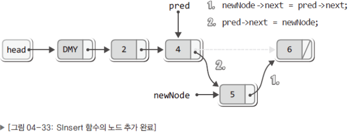

# 2024/10/21~22 연결 리스트의 정렬 삽입의 구현

SInsert 함수

```c
void SInsert(List * plist, LData data){
	Node * newNode = (Node*)malloc(sizeof(Node));             // 새 노드를 생성
	Node * pred = plist -> head;                              // pred가 더미노드를 가리킴
	newNode -> data = data;                                   // 새 노드에 데이터 저장
	
	while(pred -> next != NULL && plist -> comp(data, pred -> next -> data) != 0){
		pred = pred -> next;                                    // 다음 노드로 이동
	}
	
	newNode -> next = pred -> next;                           // 새 노드의 오른쪽을 연결
	pred -> next = newNode;                                   // 새 노드의 왼쪽을 연결
	
	(plist -> numOfData)++;                                   // 저장된 데이터의 수 하나 증가
}
```



plist -> comp(data, pred -> next -> data) != 0) 의 의미

- comp가 0을 반환
    
    첫 번째 인자인 data가 두 번째 인자인 pred → next → data보다 정렬 순서상 앞서서 head에 더 가까워야 하는 경우
    
- comp가 1을 반환
    
    두 번째 인자인 pred → next → data가 첫 번째 인자인 data보다 정렬 순서상 앞서서 head에 가까워야 하는 경우
    

지금 배우는 코드에서 정렬 기준은 입력 받은 데이터가 작으면 앞쪽, 크면 뒤쪽인 듯.

정렬의 기준을 설정하기 위한 함수의 정의(정렬의 기준을 결정하는 SetSortRule의 인자가 될 함수를 정의)

이 함수를 정의하는데 필요한 정보 두 가지

1. 두 개의 인자를 전달 받도록 함수를 정의
2. 첫 번째 인자의 정렬 우선순위가 높으면 0을, 아니면 1을 반환

ex)

```c
int WhoIsPrecede(int d1, int d2){
	if(d1 <d2){
		return 0;         // d1이 정렬 순서상 앞선다
	}
	else{
		return 1;         // d2가 정렬 순서상 앞서거나 같다.
	}
}
```

연결 리스트의 정렬 기준을 자유롭게 결정하기 위해서 이 함수는 연결 리스트를 활용하는 main 함수에 위치해야 한다.