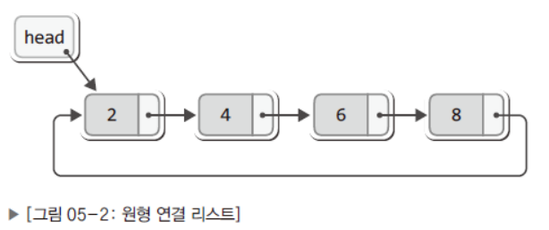

# 2024/10/23, 25, 28 원형 연결 리스트

### 원형 연결 리스트

지금까지 배운 단순 리스트는 head→ㅁ→ㅁ→ㅁ→ㅁ 이런 모양으로 마지막 노드가 NULL을 가리켰다.

이번에 배운 원형 연결 리스트는



이런 모양으로 마지막 노드가 첫 번째 노드를 가리키게 한다.

### 변형된 원형 연결 리스트


 변형된 원형 연결 리스트는 head와 tail이 모두 있고, tail → next가 가리키는 것이 첫 번째 노드이므로 이 점을 이용하면 어렵지 않게 머리와 꼬리에 새로운 노드를 추가할 수 있다.

### 변형된 원형 연결 리스트의 초기화와 노드 삽입

```c
초기화

void ListInit(List * plist){
	plist -> tail = NULL;
	plist -> cur = NULL;
	plist -> before = NULL;
	plist -> numOfData = 0;
}

삽입(LInsert와 LInsertFront의 공통 부분(첫 번째 노드 생성))

void LInser~(List * plist, Data data){              // LInsert와 LInsertFront의 공통 부분
	Node * newNode = (Node*)malloc(sizeof(Node));     // 새로운 노드 생성
	newNode -> data = data;                           // 새로운 노드에 데이터 저장
	
	if(plist -> tail == NULL){                        // 첫 번째 노드라면
		plist -> tail = newNode;                        // tail이 새로운 노드를 가리키게 함
		newNode -> next = newNode;                      // 새로운 노드가 자신을 가리키게 함
	)
	else{                                             // 두 번째 이후의 노드라면
	            .... 차이가 나는 부분 ....	
	}
	(plist -> numOfData)++;
}
```

### LInsert와 LInsertFront 다른 부분

LInsertFront

```c
LInsertFront(머리에 노드를 추가하는 함수)

else{
	newNode -> next = plist -> tail -> next;      // 새 노드를 마지막으로 추가됐던 노드에 연결
	plist -> tail -> next = newNode;              // 꼬리와 새 노드를 연결
}
```


LInsert

```c
LInsert(꼬리에 노드를 추가하는 함수)

else{
	newNode -> next = plist -> tail -> next;
	plist -> tail -> next = newNode;
	plist -> tail = newNode;                       //LInsertFront와 유일한 차이점 
}
```


### 조회

```c
Lfirst함수

int LFirst(List * plist, Data * pdata){
	if(plist -> tail == NULL){                 // 저장된 노드가 없다면
		return FALSE;
	}
	
	plist -> before = plist -> tail;           // before가 꼬리를 가리키게 함
	plist -> cur = plist -> tail -> next;      // cur이 머리를 가리키게 함
	
	*pdata = plist -> cur -> data;             // cur이 가리키는 노드의 데이터 반환
	return TRUE;
}

LNext함수

int LNext(List* plist, Data * pdata){
	if(plist -> tail == MULL){                   // 저장된 노드가 없다면
		return FALSE;
	}
	
	plist -> before = plist -> cur;              // before가 다음 노드를 가리키게 함
	plist -> cur = plist -> cur -> next;         // cur이 다음 노드를 가리키게 함
	
	*pdata = plist -> cur -> data;               // cur이 가리키는 노드의 데이터 봔환
	return TRUE;
}
```

### 삭제

방법

`1. 삭제할 노드의 이전 노드가 삭제할 노드의 다음 노드를 가리키게 한다.

1. 포인터 변수 cur을 한 칸 뒤로 이동시킨다.

예외 상황

원형 연결 리스트에는 더미 노드가 존재하지 않기 때문에 두 가지 예외 상황을 구분해야 함

1. 삭제할 노드를 tail이 가리키는 경우 → 삭제될 노드의 이전 노드가 tail이 되어야 함
2. 삭제할 노드가 리스트에 혼자 남은 경우 → tail이 NULL을 가리키게 해야 함

```c
Data LRemove(List * plist){
	Node * rpos = plist -> cur;
	Data rdata = rpos -> data;
	
	if(rpos == plist -> tail){                           // 삭제 대상을 tail이 가리킨다면
		if(plist -> tail == plist -> tail -> next){        // 그리고 마지막 남은 노드라면
			plist -> tail = NULL;
		}
		else{
			plist -> tail = plist -> before;
		}
	}
	plist -> before = plist -> cur -> next;
	plist -> cur = plist -> before;
	
	free(rpos);
	(plist -> numOfData)--;
	return rdata;
}
```