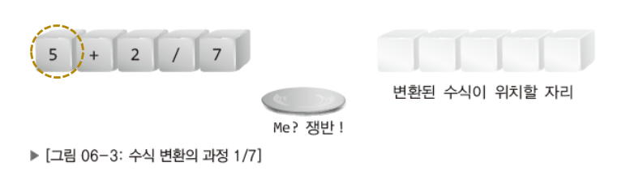

# 2024/11/15 계산기 프로그램 구현(표기법 변환)

### 수식의 표기법

- 중위 표기법: ex 1) 5 + 2 / 7                   ex 1-1) (1 + 2) * 7
- 전위 표기법: ex 2) + 5 / 2 7                   ex 2-1) * + 1 2 7
- 후위 표기법: ex 3) 5 2 7 / +                   ex 3-1) 1 2 + 7 *

## 중위 표기법을 후위 표기법으로 바꾸기(소괄호를 고려하지 않음)

### 연산 진행 과정

1. 중위 표기법의 수식을 후위 표기법의 수식으로 바꾼다.
2. 후위 표기법으로 바뀐 수식을 계산하여 그 결과를 얻는다.

숫자는 변환된 수식이 위치할 자리에 가져다 놓는다.

연산자는 쟁반으로 옮긴다.

쟁반에 위치한 연산자의 우선순위가 높다면

1. 쟁반에 위치한 연산자를 꺼내서 변환된 수식이 위치할 자리로 옮긴다.
2. 새 연산자는 쟁반으로 옮긴다.

쟁반에 위치한 연산자의 우선순위가 낮다면

1. 쟁반에 위치한 연산자의 위에 새 연산자를 쌓는다.

쟁반은 스택이므로 위에서부터 꺼내야한다.

설명하지 못한 경우의 수

1. 쟁반에 +가 있고 동일한 우선 순위인 -가 등장했을 때
- 사칙연산의 경우 연산자의 우선순위가 동일하면 먼저 등장한 연산자를 먼저 진행하므로 +가 우선순위가 높다고 가정하여 쟁반에서 변환된 수식이 위치할 자리로 옮긴 후 -를 쟁반에 올린다.

1. 

- 이 경우에는 +와 /가 -보다 먼저 진행되어야 하기 때문에 /와 +를 먼저 쟁반에서 변환된 수식이 위치할 자리로 옮긴 후 -를 쟁반에 올린다.

## 중위 표기법을 후위 표기법으로 바꾸기(소괄호를 고려하고)

후위 표기법으로 변환을 하면 소괄호는 소멸되므로 변환된 수식이 위치할 자리는 7자리가 된다.

소괄호도 어디까지가 소괄호 안에 포함된 연산자인지 구분을 해줘야 하기 때문에 쟁반에 쌓아 올린다.

여기서는 우선순위가 낮은 +가 먼저 나와서 *가 그 위로 올라갔다. 

만약 +보다 우선순위가 낮은 연산자가 등장했다면 +를 변환된 수식이 위치할 자리에 이동시키고 새로운 연산자를 쟁반에 올려야 한다.

소괄호의 끝( ‘ ) ’ )이 나오면 ( 연산자 이후에 쌓인 연산자들을 쟁반에서 꺼내어 변환된 수식이 위치할 자리로 옮긴다.

---

사진 출처: 

[Chap 06. 스택(Stack) [윤성우의 열혈 자료구조]](https://velog.io/@doriskim/Chap-06.-%EC%8A%A4%ED%83%9DStack-%EC%9C%A4%EC%84%B1%EC%9A%B0%EC%9D%98-%EC%97%B4%ED%98%88-%EC%9E%90%EB%A3%8C%EA%B5%AC%EC%A1%B0)